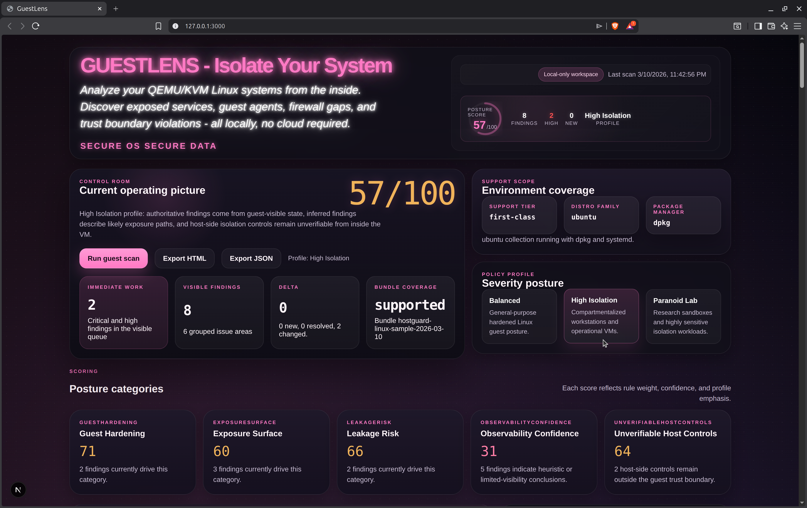
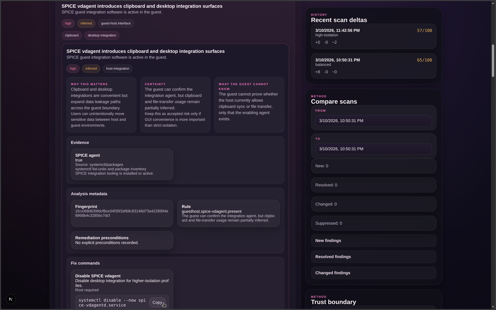
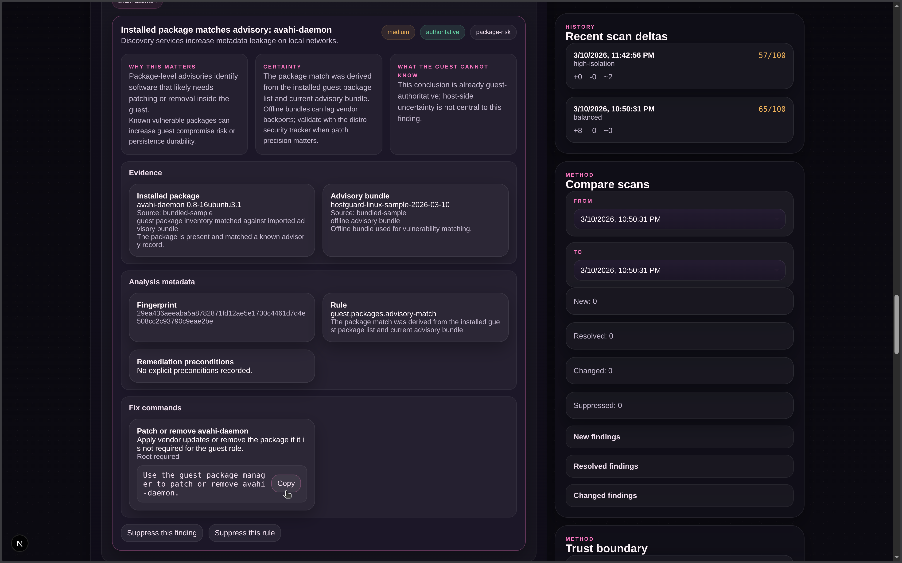
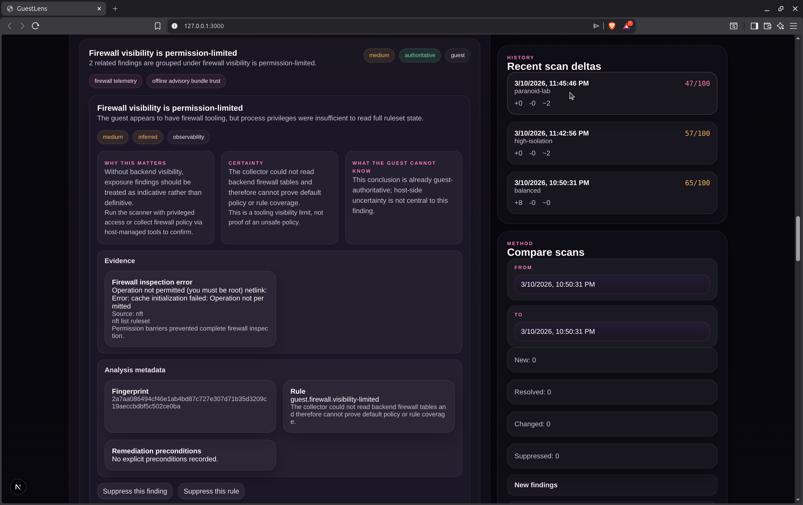

# GuestLens

GuestLens is a local-first security posture analyzer for Linux guests running under QEMU/KVM. It inspects the VM from the inside, records only guest-visible evidence, and turns that evidence into posture scores, grouped findings, remediation steps, scan history, and exportable reports.

The project is built for operators who want a realistic answer to a narrow but important question:

> What can this guest actually prove, infer, or not know about its own exposure and isolation posture?

GuestLens does not depend on a cloud backend, does not require outbound network access for normal use, and does not pretend the guest can certify host-side controls it cannot see.

## Screenshots

### 01. Overview dashboard



### 02. Finding details, evidence, remediation, and scan history



### 03. Advisory match workflow and suppression controls



### 04. Permission-limited firewall visibility and compare-scans panel



## What GuestLens Does

GuestLens combines three local subsystems:

- A collector that runs inside the guest and gathers guest-visible state.
- An analyzer that converts raw state into normalized findings, posture scores, and deltas.
- A local dashboard and API layer that lets you run scans, filter findings, review history, and export reports.

The result is a scanner that is opinionated about trust boundaries:

- Guest-visible facts are treated as authoritative.
- Cross-boundary conclusions are marked as inferred when they depend on indirect evidence.
- Host-only controls remain explicitly unverifiable from inside the guest.

## Why This Project Exists

Many security tools describe the VM from the outside: host policies, hypervisor flags, libvirt XML, image settings, or network controls. Those are useful, but they answer a different question than the one an operator inside the guest often needs answered.

GuestLens focuses on:

- What services are actually exposed from the guest's perspective.
- Which guest-host integration paths are visible and potentially risky.
- Whether firewall, SSH, LSM, package, and file-permission posture are strong or weak based on direct evidence.
- Which conclusions are limited by permissions or trust-boundary visibility.
- What changed between scans, including newly introduced, resolved, changed, and suppressed findings.

## Core Capabilities

### Evidence-Backed Posture Analysis

Every finding is built from concrete evidence records that include:

- what was observed
- where it came from
- the file path or command used
- how the evidence should be interpreted
- why the confidence level is authoritative, inferred, or unverifiable

### Guest-Visible Security Checks

GuestLens analyzes:

- Linux security module state such as SELinux and AppArmor
- firewall posture and visibility quality
- SSH daemon defaults and risky directives
- public listeners and network discovery exposure
- cloud metadata route visibility
- QEMU guest agent, SPICE, VSOCK, shared folders, ballooning, RNG, and other virtualization surfaces
- package advisory matches using imported offline bundles
- world-writable or otherwise sensitive permission issues
- guest-visible environment metadata such as distro family, init system, package manager, and support tier

### Grouped Findings and Remediation

Findings are grouped into operator-oriented issue areas with:

- severity
- confidence level
- trust boundary classification
- impacted surfaces
- rationale and operator impact
- false-positive guidance
- remediation commands when the issue is actionable from inside the guest

### Historical Deltas

GuestLens stores scan history locally and highlights:

- new findings
- resolved findings
- changed findings
- suppressed findings

This makes it useful both for one-off hardening reviews and ongoing drift tracking.

### Suppressions

Suppressions can be created against:

- a rule ID
- a finding fingerprint

They are stored locally and applied back onto findings and delta summaries when scans are viewed or exported.

### Local Export

GuestLens can export:

- sanitized JSON for automation or archival
- standalone HTML reports for review and sharing

Exports are explicit about omitted host-only data so the report cannot be mistaken for a full hypervisor audit.

## Trust Model

GuestLens is strict about what the guest can and cannot know.

### Confidence Levels

- `authoritative`: directly observed in the guest
- `inferred`: reasonably derived from guest-visible evidence, but not directly proven
- `unverifiable`: depends on host-side controls or policies the guest cannot inspect

### Boundary Labels

- `guest`: entirely within the guest trust boundary
- `guest-host interface`: crosses the isolation boundary through integration surfaces
- `host-unverifiable`: depends on host or hypervisor controls outside guest visibility

### Important Limitation

GuestLens does **not** prove:

- libvirt XML correctness
- hypervisor launch flags
- host firewall policy
- host storage handling
- snapshot policy
- IOMMU or passthrough isolation correctness
- final escape resistance

Those controls matter, but they must be validated from the host or hypervisor layer, not from inside the guest.

## Supported Environments

Best results are expected on:

- Debian 12 guests
- Ubuntu 22.04+ guests
- QEMU/KVM virtual machines
- systemd-based systems

Best-effort support exists for:

- RHEL-family guests
- Arch-based guests
- alternative init systems

The collector still works on many systems outside the first-class path, but evidence quality and rule coverage may be reduced.

## Architecture

GuestLens is intentionally small and local.

### Collector

The collector gathers state by reading guest-visible files and running local commands. It serves scan requests over a Unix domain socket and returns a normalized snapshot object.

The collector is responsible for reading data such as:

- listening sockets
- routes and DNS servers
- packages and services
- mount points
- SSH configuration
- firewall state
- LSM state
- virtualization hints

### Analyzer

The analyzer converts a snapshot into:

- findings
- grouped findings
- posture category scores
- top priorities
- trust statements
- scan delta metadata

It also preserves stable rule IDs and fingerprints so results can be compared across scans.

### Local Dashboard

The dashboard is a Next.js application bound to localhost. It provides:

- current posture summary
- profile switching
- filterable findings queue
- scan history
- delta comparison
- suppression controls
- JSON and HTML export

## Project Layout

```text
app/                  Next.js routes, API handlers, and global styles
components/           Dashboard UI
lib/security/         Collector, analyzer, storage, delta, profiles, advisories
data/advisories/      Bundled sample advisory data
scripts/              Local entry points for dev, start, collector, and advisory import
tests/                Analyzer, advisory, and delta tests
docs/                 Architecture and operations documentation
```

## Technology Stack

- Bun 1.3.x
- Next.js 15 App Router
- React 19
- TypeScript
- SQLite through the built-in `node:sqlite` module
- Unix domain socket communication between dashboard and collector

## Installation

### Requirements

- Bun 1.3.x
- A Linux guest environment
- QEMU/KVM for the intended use case
- permission to inspect the guest state you care about

### Install Dependencies

```bash
bun install
```

## Quick Start

### Development Mode

This starts both the collector and the dashboard:

```bash
bun run dev
```

By default the dashboard binds to `127.0.0.1:3000`.

If `3000` is already in use:

```bash
PORT=3001 bun run dev
```

You can also override the host bind address:

```bash
HOST=127.0.0.1 PORT=3001 bun run dev
```

Then open:

```text
http://127.0.0.1:3000
```

or the alternate port you selected.

### Production-Style Run

```bash
bun run build
bun run start
```

### Collector Only

```bash
bun run collector
```

This is useful if you want to run the socket collector separately from the dashboard.

## Typical Workflow

1. Start the collector and dashboard with `bun run dev`.
2. Open the local dashboard inside the guest.
3. Select the policy profile that matches the guest's purpose.
4. Run a scan.
5. Review grouped findings and their evidence.
6. Apply remediation commands where appropriate.
7. Re-scan and review the delta.
8. Export JSON or HTML artifacts for records or review.

## Policy Profiles

GuestLens ships with three policy profiles:

- `balanced`: general-purpose hardened Linux guest posture
- `high-isolation`: emphasizes compartmentalized workstations and operational VMs
- `paranoid-lab`: emphasizes research sandboxes and highly sensitive isolation workloads

Profiles change scoring weight and remediation emphasis without changing the trust model.

## Data Collected

The collector builds a snapshot that includes:

- system metadata
- environment metadata
- package inventory
- service state
- mounts
- network state
- file permission issues
- security posture details
- virtualization surface state
- advisory bundle status
- vulnerability matches derived from the imported advisory bundle

This snapshot is then analyzed and stored locally with a schema version.

## Findings Model

Each finding can include:

- rule ID
- fingerprint
- title and summary
- severity
- confidence
- trust-boundary label
- rationale
- operator impact
- certainty explanation
- false-positive guidance
- remediation actions
- evidence records
- suppression metadata

Grouped findings also include impacted surfaces and issue-level summaries so the UI stays operator-friendly even when multiple low-level checks contribute to one review area.

## Advisory Bundles

GuestLens supports imported offline advisory bundles for package-level matching.

Import a bundle with:

```bash
bun run advisories:import /path/to/advisories.bundle.json
```

The imported bundle status records:

- bundle ID
- generator version
- generation time
- expiry time
- verification status
- SHA256 digest
- support scope
- coverage level
- validation issues

If the bundle is stale or outside supported distro scope, GuestLens keeps that visible in both posture and findings instead of quietly overstating certainty.

## Runtime, State, and Environment Variables

### Default Paths

| Purpose | Path |
| --- | --- |
| Collector socket | `$XDG_RUNTIME_DIR/guestlens/collector.sock` |
| Collector socket fallback | `/tmp/guestlens-<uid>/collector.sock` |
| State directory | `$XDG_STATE_HOME/guestlens` |
| State directory fallback | `~/.local/state/guestlens` |
| SQLite database | `guestlens.db` inside the state directory |
| Imported advisory bundle | `advisories.bundle.json` inside the state directory |

### Environment Variables

| Variable | Purpose |
| --- | --- |
| `HOST` | Override dashboard bind address for `bun run dev` and `bun run start` |
| `PORT` | Override dashboard port for `bun run dev` and `bun run start` |
| `HOSTGUARD_STATE_DIR` | Override the persistent GuestLens state directory |
| `HOSTGUARD_RUNTIME_DIR` | Override the collector runtime directory and socket location |
| `XDG_STATE_HOME` | Standard XDG state base directory |
| `XDG_RUNTIME_DIR` | Standard XDG runtime base directory |

## Local API Surface

The dashboard exposes local API routes under `app/api`:

| Route | Method | Purpose |
| --- | --- | --- |
| `/api/scan` | `POST` | Run a fresh scan |
| `/api/scan/[scanId]` | `GET` | Load a stored scan by ID |
| `/api/posture` | `GET` | Load the latest posture summary |
| `/api/findings` | `GET` | Load latest findings and grouped findings |
| `/api/history` | `GET` | Load stored scan history |
| `/api/diff` | `GET` | Compare scans or return the latest stored delta |
| `/api/profiles` | `GET` | Return available policy profiles and current selection |
| `/api/profile` | `POST` | Change the active policy profile |
| `/api/suppressions` | `GET`, `POST`, `DELETE` | Manage suppressions |
| `/api/export` | `GET` | Export JSON or HTML reports |

These routes are intended for local UI use and local automation, not public exposure.

## Exports

### JSON Export

The JSON export includes:

- schema version
- product metadata
- scan ID and collection timestamp
- profile
- system and environment metadata
- advisory bundle status
- posture summary
- delta summary
- findings

It also includes an `omittedData` section so consumers know which host-only controls are intentionally absent.

### HTML Export

The HTML export produces a standalone report suitable for:

- recordkeeping
- local sharing
- attachment to internal hardening notes
- before-and-after comparisons

## Persistence and Backup

The state directory preserves:

- scan history
- posture outputs
- grouped findings
- scan deltas
- suppressions
- imported advisory bundle metadata

Back up the entire GuestLens state directory if you want to preserve long-term scan history.

## Troubleshooting

### Port `3000` is already in use

Run on another port:

```bash
PORT=3001 bun run dev
```

### Collector socket unavailable

Start the collector directly:

```bash
bun run collector
```

Or restart the full local stack:

```bash
bun run dev
```

### Firewall visibility is limited

If firewall inspection is permission-limited, GuestLens will say so explicitly. That is usually a collection-permissions issue, not proof that the firewall is weak.

Run with the guest privileges required for ruleset inspection when appropriate.

### Advisory findings look incomplete

Check:

- whether a bundle has been imported
- whether the bundle is stale
- whether the bundle support scope matches the guest distro

### Guest network is unstable

GuestLens can show:

- what routes and DNS the guest sees
- whether public listeners exist
- whether metadata routes are present

It cannot prove host-side NAT, bridge, firewall, or libvirt correctness from inside the guest. Diagnose those from the host layer.

## Security Notes

- GuestLens is local-only by design.
- The dashboard binds to localhost by default.
- The collector uses a Unix domain socket with restrictive permissions.
- State directories are created with private permissions.
- Findings are intentionally explicit about uncertainty so operators do not mistake inferred conclusions for host-verified truth.

## Development

### Run Tests

```bash
bun test
```

### Type Check

```bash
bun x tsc --noEmit
```

### Production Build

```bash
bun run build
```

## Related Documentation

- [docs/ARCHITECTURE.md](docs/ARCHITECTURE.md)
- [docs/RUNBOOK.md](docs/RUNBOOK.md)
- [SECURITY.md](SECURITY.md)

## License

MIT. See [LICENSE](LICENSE).
